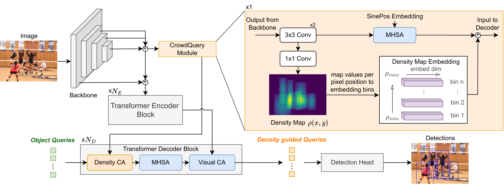
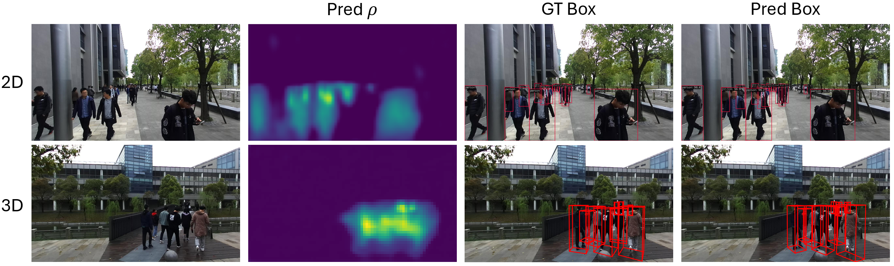

# CrowdQuery: Density-Guided Query Module for Enhanced 2D and 3D Detection in Crowded Scenes

This is the official repository for CrowdQuery which will be published at IROS 2025.   
**Authors**: Marius Dähling, Sebastian Krebs and J. Marius Zöllner





## Abstract
This paper introduces a novel method to end-to-end crowd detection that leverages object density information to enhance existing transformer-based detectors. 
We present CrowdQuery (CQ), whose core component is our CQ module that predicts and subsequently embeds an object density map. 
The embedded density information is then systematically integrated into the decoder. 
Existing density map definitions typically depend on head positions or object-based spatial statistics. 
Our method extends these definitions to include individual bounding box dimensions. 
By incorporating density information into object queries, our method utilizes density-guided queries to improve detection in crowded scenes. 
CQ is universally applicable to both 2D and 3D detection without requiring additional data. 
Consequently, we are the first to design a method that effectively bridges 2D and 3D detection in crowded environments. 
We demonstrate the integration of CQ into both a general 2D and 3D transformer-based object detector, introducing the architectures CQ2D and CQ3D. 
CQ is not limited to the specific transformer models we selected. 
Experiments on the STCrowd dataset for both 2D and 3D domains show significant performance improvements compared to the base models, outperforming most state-of-the-art methods. 
When integrated into a state-of-the-art crowd detector, CQ can help to further improve performance on the challenging CrowdHuman dataset, demonstrating its generalizability. 

## Getting Started
The repository is separated into the 2D and 3D detection part respectively, as we build on different existing model bases. Our general density related code is seperated.

### Setup
We provide for both versions docker files which contain all required packages and dependencies. 
Hence, the environment setup is straightforward:
1. Clone the repository.
2. Build either the [Dockerfile_2d](docker/Dockerfile_2d) or [Dockerfile_3d](docker/Dockerfile_3d) based on the domain you are interested in.
3. Download the [STCrowd dataset](https://4dvlab.github.io/STCrowd/index.html).
4. Adjust the path to the dataset in the respective configs [stcrowd_config.py](two_d/configs/stcrowd_config.py) for 2D and [stcrowd_density_first-regression.yaml](three_d/configs/stcrowd_density_first-regression.yaml) for 3D. 
5. You may need to add the repo to your PYTHONPATH.

We created our own annotation files to be compatible with each code basis. The files can be downloaded [here](https://drive.google.com/drive/folders/1BH1H6PAvBhmbMg1cS5djxhAXuj87b6Hr?usp=sharing). As the files are just a reformatted version of the original dataset, the original Creative Commons Attribution-NonCommercial-ShareAlike 3.0 License of STCrowd applies to them.

NOTE: If you do not use the default data path "./data/st_crowd" and want to train a 3D detector, you need to adjust the paths in the pickle files.

### Training
We trained our models using a single A100 80Gb.

Train the 2D model by running inside the 2D container
```
./two_d/train.sh
```

Train the 3D model by running inside the 3D container
```
./three_d/train.sh
```

## License
See [LICENSE](LICENSE) for more details.

## Acknowledgments
Our 2D implementation is built upon [mmdetection](https://github.com/open-mmlab/mmdetection) and relies on their [Deformable DETR](https://arxiv.org/abs/2010.04159) code basis.
Our 3D implementation is built upon [MonoDETR](https://github.com/ZrrSkywalker/MonoDETR). 
This work wouldn't have been possible without the invaluable contributions of the aforementioned projects and numerous other high-quality open-source initiatives.
Many thanks to them for enabling our research!
